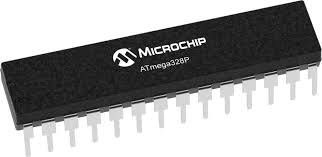
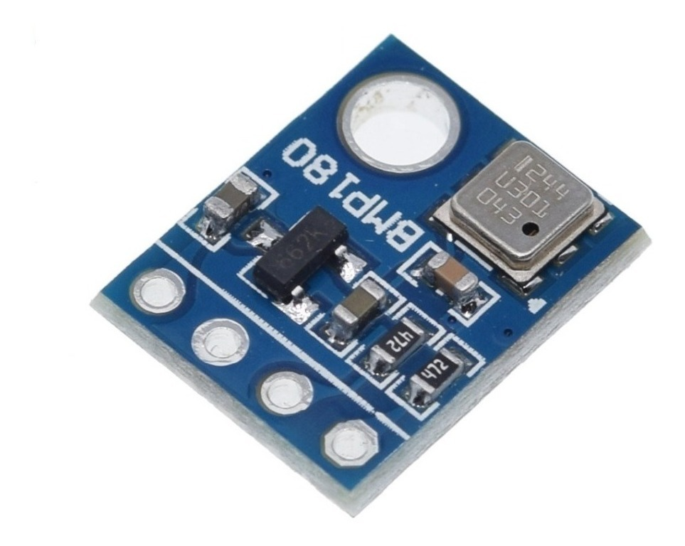
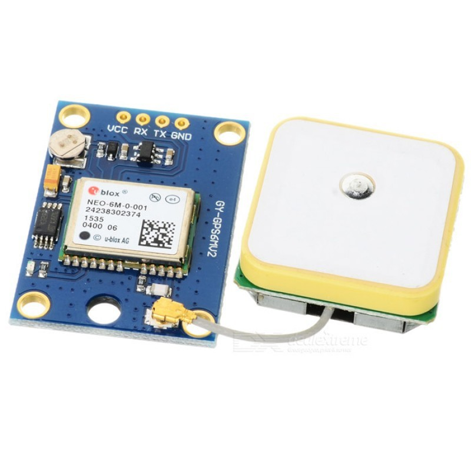
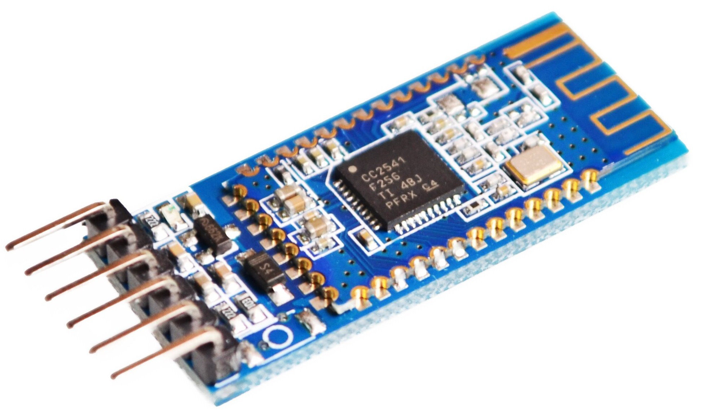
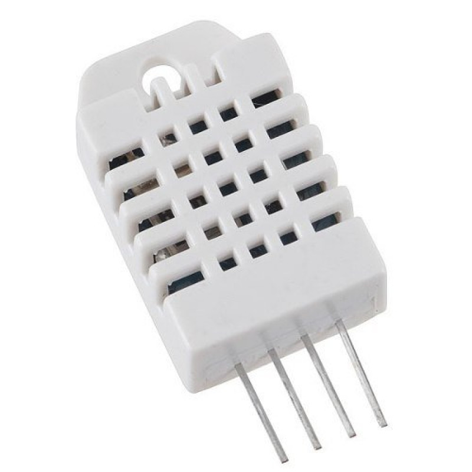

# Black Headed Vulture
- Weather Station of the Atmospheric Discharges Research Laboratory - LPDA UFPA.

# Description
This is a project of a Weather Station based on:
- Microcontroller Atmega328p.

- Barometric Sensor BMP180

- GPS Neo6m

- Bluetooth module AT-09 

- Humidity and Temperature sensor DHT22

# Structure
- #### app/ 
        Contains a main function
- #### flowcharts/
        Contains some flowcharts that describe how some driver works, bmp180 for example.
- #### src/avr_libs/ 
        Contains libraries to drive avr328p tools like spi, twi, adc, etc. and some drivers to work with modules.
- #### src/FatFs/
        Contains a implementations of FatFs filesystem developed by ChaN http://elm-chan.org/
- #### tests/
        Contains some routines to test libraries and functionalities separately
# LICENSE
        [This project is distributed by this license](LICENSE)